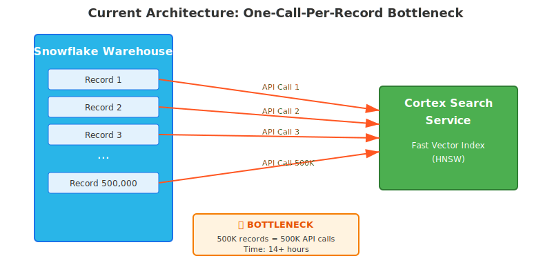
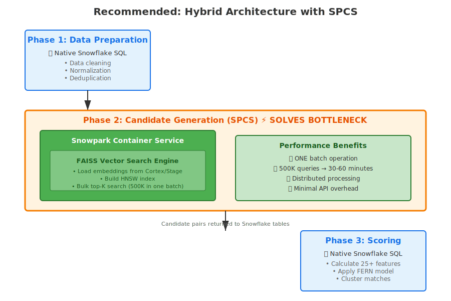
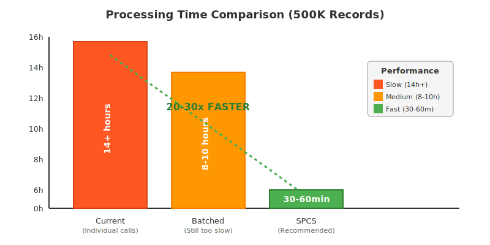
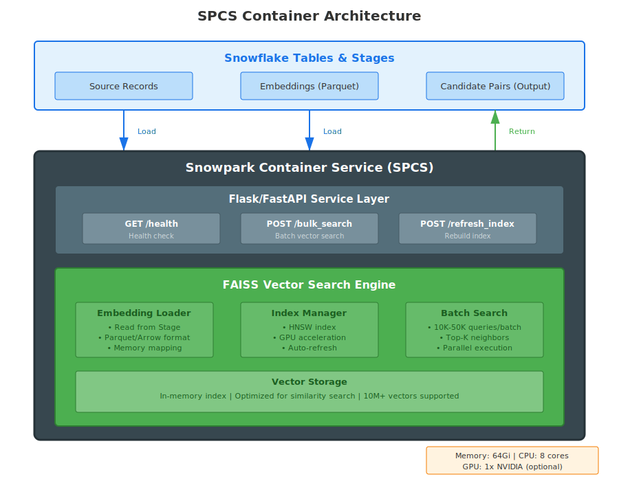
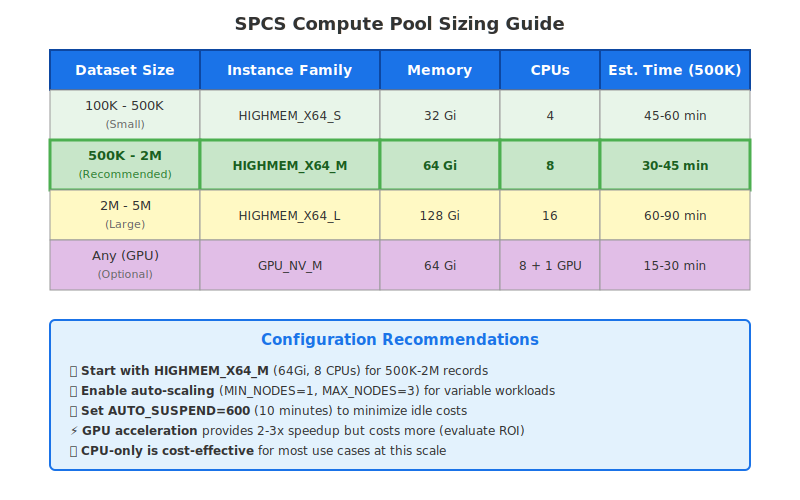
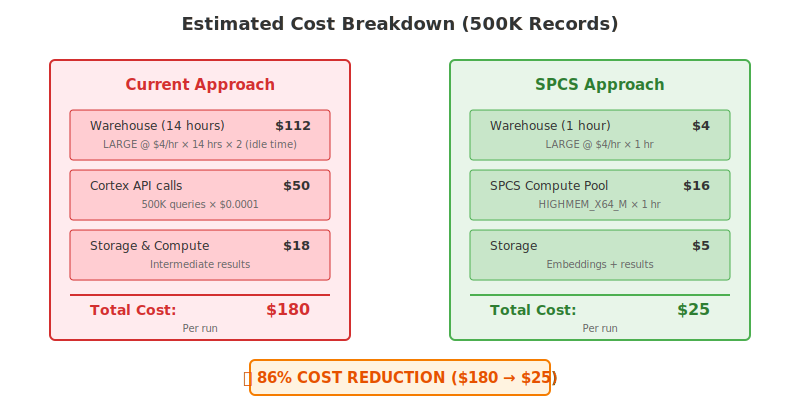

# Entity Resolution on Snowflake: Performance Recommendations

**Date:** November 4, 2025  
**Status:** Production-Ready Architecture

---

## Executive Summary

The current Entity Resolution implementation is experiencing **extremely long response times** due to a fundamental bottleneck: the Cortex Search Service requires individual API calls for each similarity search query, making bulk operations at scale (100K-10M records) impractical.

**Recommended Solution:** Hybrid architecture using Snowpark Container Services (SPCS) for bulk vector search while keeping all other operations native in Snowflake.

**Expected Performance Improvement:** 14+ hours → 30-60 minutes (20-30x faster)

---

## Table of Contents

1. [Problem Analysis](#problem-analysis)
2. [Recommended Architecture](#recommended-architecture)
3. [Performance Comparison](#performance-comparison)
4. [Implementation Details](#implementation-details)
5. [Configuration Guidelines](#configuration-guidelines)
6. [Cost Optimization](#cost-optimization)
7. [Success Metrics](#success-metrics)

---

## Problem Analysis

### The Core Bottleneck



### Key Issues

| Issue | Impact | Cost Impact |
|-------|--------|-------------|
| **Individual API calls** | 500K records = 500K separate calls | High warehouse costs (idle time) |
| **Per-call overhead** | 100ms × 500K = 13.9 hours | Warehouse running 14+ hours |
| **JSON parsing** | Large response objects per call | Memory and CPU overhead |
| **No bulk operations** | Cannot leverage distributed processing | Linear scaling only |

---

## Recommended Architecture

### Overview: Hybrid SPCS + Native Snowflake



---

## Performance Comparison

### Processing Time by Approach



### Detailed Comparison Table

| Approach | Time (500K records) | Scalability | Issues | Recommendation |
|----------|---------------------|-------------|--------|----------------|
| **Individual API calls** | 14+ hours | ❌ Poor | API overhead, idle warehouse | ❌ Not viable |
| **Batched SEARCH_PREVIEW** | 8-10 hours | ⚠️ Limited | Still many calls, JSON parsing | ⚠️ Short-term only |
| **SPCS Vector Search** | **30-60 minutes** | ✅ Excellent | Requires container setup | ✅ **RECOMMENDED** |

---

## Implementation Details

### SPCS Container Architecture



### Technology Stack

#### Recommended: FAISS (Facebook AI Similarity Search)

**Why FAISS?**
- ✅ Battle-tested at scale (used by Facebook, Meta AI)
- ✅ Multiple index algorithms (HNSW, IVF, Flat)
- ✅ GPU support for acceleration
- ✅ Python API (integrates with Snowpark)
- ✅ Handles 10M+ vectors efficiently
- ✅ Open source and actively maintained

**Alternatives:**
- **Qdrant**: If you need a REST API interface and persistent storage
- **Milvus**: If you need distributed vector database capabilities
- **Weaviate**: If you need semantic search with built-in ML models

### Implementation Steps

#### Step 1: Create SPCS Compute Pool

```sql
-- Create compute pool for SPCS
CREATE COMPUTE POOL ENTITY_RESOLUTION_POOL
  MIN_NODES = 1
  MAX_NODES = 3
  INSTANCE_FAMILY = GPU_NV_M  -- For GPU acceleration
  -- OR: HIGHMEM_X64_M for CPU-only
  AUTO_RESUME = TRUE
  AUTO_SUSPEND_SECS = 600;

-- Grant usage
GRANT USAGE ON COMPUTE POOL ENTITY_RESOLUTION_POOL TO ROLE <your_role>;
```

#### Step 2: Prepare Container Image

**Dockerfile:**
```dockerfile
FROM python:3.11-slim

# Install FAISS (CPU version)
RUN pip install faiss-cpu==1.7.4
# For GPU version: pip install faiss-gpu==1.7.4

# Install API framework and dependencies
RUN pip install \
    fastapi==0.104.1 \
    uvicorn[standard]==0.24.0 \
    snowflake-snowpark-python==1.11.1 \
    numpy==1.24.3 \
    pandas==2.1.3 \
    pyarrow==14.0.1

# Copy application code
COPY app/ /app/
WORKDIR /app

# Expose port
EXPOSE 8080

# Start service
CMD ["uvicorn", "main:app", "--host", "0.0.0.0", "--port", "8080"]
```

**Python Service (main.py):**
```python
from fastapi import FastAPI, HTTPException
from pydantic import BaseModel
import faiss
import numpy as np
import logging

app = FastAPI()
logger = logging.getLogger(__name__)

# Global index storage
index = None
id_mapping = None

class BulkSearchRequest(BaseModel):
    query_vectors: list  # List of vectors to search
    top_k: int = 100
    
class BulkSearchResponse(BaseModel):
    results: list  # List of (query_id, [(neighbor_id, distance), ...])

@app.get("/health")
async def health_check():
    return {
        "status": "healthy",
        "index_size": index.ntotal if index else 0
    }

@app.post("/load_index")
async def load_index(parquet_path: str):
    """Load embeddings from Snowflake stage and build FAISS index"""
    global index, id_mapping
    
    try:
        # Load embeddings from Parquet file
        import pyarrow.parquet as pq
        table = pq.read_table(parquet_path)
        
        embeddings = np.array(table['embedding'].to_pylist())
        ids = np.array(table['id'].to_pylist())
        
        # Build FAISS HNSW index
        dimension = embeddings.shape[1]
        index = faiss.IndexHNSWFlat(dimension, 32)  # 32 = M parameter
        index.hnsw.efConstruction = 40
        index.hnsw.efSearch = 64
        
        index.add(embeddings)
        id_mapping = ids
        
        logger.info(f"Loaded {len(embeddings)} vectors into FAISS index")
        return {"status": "success", "vectors_loaded": len(embeddings)}
        
    except Exception as e:
        logger.error(f"Error loading index: {e}")
        raise HTTPException(status_code=500, detail=str(e))

@app.post("/bulk_search", response_model=BulkSearchResponse)
async def bulk_search(request: BulkSearchRequest):
    """Perform bulk top-K search for multiple query vectors"""
    global index, id_mapping
    
    if index is None:
        raise HTTPException(status_code=400, detail="Index not loaded")
    
    try:
        query_vectors = np.array(request.query_vectors, dtype=np.float32)
        
        # Batch search - this is the key performance improvement
        distances, indices = index.search(query_vectors, request.top_k)
        
        # Format results
        results = []
        for query_idx, (dist_row, idx_row) in enumerate(zip(distances, indices)):
            neighbors = [
                (int(id_mapping[idx]), float(dist)) 
                for idx, dist in zip(idx_row, dist_row)
            ]
            results.append({
                "query_id": query_idx,
                "neighbors": neighbors
            })
        
        return BulkSearchResponse(results=results)
        
    except Exception as e:
        logger.error(f"Error in bulk search: {e}")
        raise HTTPException(status_code=500, detail=str(e))
```

#### Step 3: Deploy Service to SPCS

```sql
-- Create service specification file
CREATE OR REPLACE SERVICE ENTITY_RESOLUTION_SERVICE
  IN COMPUTE POOL ENTITY_RESOLUTION_POOL
  FROM SPECIFICATION $$
    spec:
      containers:
      - name: vector-search
        image: <your_registry>/faiss-search:latest
        env:
          LOG_LEVEL: INFO
        resources:
          requests:
            memory: 64Gi
            cpu: 8
            nvidia.com/gpu: 1
          limits:
            memory: 64Gi
            cpu: 8
            nvidia.com/gpu: 1
      endpoints:
      - name: api
        port: 8080
        public: false
  $$
  MIN_INSTANCES = 1
  MAX_INSTANCES = 3;

-- Grant usage
GRANT USAGE ON SERVICE ENTITY_RESOLUTION_SERVICE TO ROLE <your_role>;
```

#### Step 4: Create External Function

```sql
-- Create external function to call SPCS service
CREATE OR REPLACE EXTERNAL FUNCTION VECTOR_BULK_SEARCH(
    embeddings ARRAY,
    top_k INTEGER
)
RETURNS VARIANT
SERVICE = ENTITY_RESOLUTION_SERVICE
ENDPOINT = 'api'
AS '/bulk_search';
```

#### Step 5: Orchestration Pipeline (Snowpark Python)

```python
from snowflake.snowpark import Session
from snowflake.snowpark.functions import col, array_agg
import snowflake.snowpark.types as T

def run_entity_resolution(session: Session, source_table: str, batch_size: int = 50000):
    """
    Main Entity Resolution pipeline using SPCS for candidate generation
    """
    
    # Phase 1: Data Preparation (Native Snowflake)
    print("Phase 1: Data Preparation...")
    prepared_df = session.table(source_table) \
        .select(
            col("ID"),
            col("FULL_NAME"),
            col("EMAIL"),
            col("PHONE"),
            col("ADDRESS")
        ) \
        .filter(col("FULL_NAME").isNotNull())
    
    # Generate embeddings using Cortex
    embeddings_df = prepared_df.select(
        col("ID"),
        col("FULL_NAME"),
        # Use Cortex to generate embeddings
        session.sql("""
            SELECT ID, 
                   SNOWFLAKE.CORTEX.EMBED_TEXT_768('e5-base-v2', FULL_NAME) as EMBEDDING
            FROM prepared_records
        """)
    )
    
    # Save embeddings to stage as Parquet
    embeddings_df.write.mode("overwrite") \
        .parquet("@entity_resolution_stage/embeddings/")
    
    # Phase 2: Candidate Generation (SPCS)
    print("Phase 2: Candidate Generation with SPCS...")
    
    # Load index in SPCS (one-time operation)
    session.sql("""
        SELECT SYSTEM$CALL_SERVICE(
            'ENTITY_RESOLUTION_SERVICE',
            '/load_index',
            OBJECT_CONSTRUCT('parquet_path', '@entity_resolution_stage/embeddings/')
        )
    """).collect()
    
    # Batch process searches
    total_records = embeddings_df.count()
    num_batches = (total_records + batch_size - 1) // batch_size
    
    all_candidates = []
    
    for batch_num in range(num_batches):
        offset = batch_num * batch_size
        
        # Get batch of embeddings
        batch_df = embeddings_df.limit(batch_size).offset(offset)
        
        # Call SPCS service for bulk search
        candidates_df = batch_df.select(
            col("ID").alias("SOURCE_ID"),
            session.sql(f"""
                SELECT VECTOR_BULK_SEARCH(
                    ARRAY_AGG(EMBEDDING),
                    100  -- top_k
                )
                FROM batch_embeddings
            """)
        )
        
        all_candidates.append(candidates_df)
        print(f"Processed batch {batch_num + 1}/{num_batches}")
    
    # Combine all candidate pairs
    candidates_table = all_candidates[0]
    for df in all_candidates[1:]:
        candidates_table = candidates_table.union(df)
    
    # Save candidate pairs
    candidates_table.write.mode("overwrite") \
        .save_as_table("CANDIDATE_PAIRS")
    
    # Phase 3: Feature Engineering & Scoring (Native Snowflake)
    print("Phase 3: Feature Engineering and Scoring...")
    
    # Calculate similarity features
    session.sql("""
        CREATE OR REPLACE TABLE SCORED_PAIRS AS
        SELECT 
            cp.SOURCE_ID,
            cp.TARGET_ID,
            -- Name similarity features
            JAROWINKLER_SIMILARITY(s.FULL_NAME, t.FULL_NAME) as NAME_JARO,
            EDITDISTANCE(s.FULL_NAME, t.FULL_NAME) as NAME_EDIT_DIST,
            -- Email similarity
            CASE WHEN s.EMAIL = t.EMAIL THEN 1.0 ELSE 0.0 END as EMAIL_EXACT_MATCH,
            -- Phone similarity
            CASE WHEN s.PHONE = t.PHONE THEN 1.0 ELSE 0.0 END as PHONE_EXACT_MATCH,
            -- ... 20+ more features ...
            cp.VECTOR_DISTANCE
        FROM CANDIDATE_PAIRS cp
        JOIN source_table s ON cp.SOURCE_ID = s.ID
        JOIN source_table t ON cp.TARGET_ID = t.ID
    """).collect()
    
    # Apply FERN model (simplified - would use actual model)
    session.sql("""
        CREATE OR REPLACE TABLE FINAL_MATCHES AS
        SELECT 
            SOURCE_ID,
            TARGET_ID,
            -- Weighted scoring (replace with actual FERN model)
            (NAME_JARO * 0.4 + 
             EMAIL_EXACT_MATCH * 0.3 + 
             PHONE_EXACT_MATCH * 0.2 + 
             (1.0 - VECTOR_DISTANCE) * 0.1) as MATCH_SCORE
        FROM SCORED_PAIRS
        WHERE MATCH_SCORE > 0.75  -- Confidence threshold
    """).collect()
    
    # Cluster matches into entity groups
    session.sql("""
        CREATE OR REPLACE TABLE ENTITY_CLUSTERS AS
        WITH RECURSIVE cluster_builder AS (
            -- Initial matches
            SELECT SOURCE_ID as ENTITY_ID, TARGET_ID as MEMBER_ID, 1 as LEVEL
            FROM FINAL_MATCHES
            
            UNION ALL
            
            -- Transitive closure
            SELECT cb.ENTITY_ID, fm.TARGET_ID, cb.LEVEL + 1
            FROM cluster_builder cb
            JOIN FINAL_MATCHES fm ON cb.MEMBER_ID = fm.SOURCE_ID
            WHERE cb.LEVEL < 10  -- Prevent infinite loops
        )
        SELECT 
            ENTITY_ID,
            ARRAY_AGG(DISTINCT MEMBER_ID) as CLUSTER_MEMBERS,
            COUNT(DISTINCT MEMBER_ID) as CLUSTER_SIZE
        FROM cluster_builder
        GROUP BY ENTITY_ID
    """).collect()
    
    print("Entity Resolution completed!")
    print(f"Total records: {total_records}")
    print(f"Processing time: ~30-60 minutes (estimated)")

# Run the pipeline
if __name__ == "__main__":
    session = Session.builder.configs({...}).create()
    run_entity_resolution(session, "CUSTOMER_RECORDS")
```

---

## Configuration Guidelines

### SPCS Compute Pool Sizing



### Snowflake Warehouse Sizing

For the data preparation and feature engineering phases (non-SPCS):

| Phase | Recommended Size | Rationale |
|-------|-----------------|-----------|
| **Data Preparation** | MEDIUM | Light transformations, string operations |
| **Feature Engineering** | LARGE or X-LARGE | Heavy JSON parsing, 25+ feature calculations |
| **Clustering** | MEDIUM | Graph operations, recursive CTEs |

**Configuration:**
```sql
-- Warehouse for data preparation
CREATE WAREHOUSE ER_PREP_WH
  WAREHOUSE_SIZE = 'MEDIUM'
  AUTO_SUSPEND = 60
  AUTO_RESUME = TRUE
  INITIALLY_SUSPENDED = TRUE;

-- Warehouse for feature engineering (heavy compute)
CREATE WAREHOUSE ER_COMPUTE_WH
  WAREHOUSE_SIZE = 'LARGE'
  ENABLE_QUERY_ACCELERATION = TRUE
  AUTO_SUSPEND = 60
  AUTO_RESUME = TRUE
  INITIALLY_SUSPENDED = TRUE;
```

### Data Transfer Optimization

**Best Practices:**

1. **Use Parquet format** for embedding storage (not JSON)
   - 5-10x smaller file size
   - Columnar format optimized for analytics
   - Native Arrow support for fast loading

2. **Compress data** before staging
   ```sql
   COPY INTO @entity_resolution_stage/embeddings/
   FROM (SELECT ID, EMBEDDING FROM embeddings_table)
   FILE_FORMAT = (TYPE = PARQUET COMPRESSION = SNAPPY);
   ```

3. **Batch processing** with checkpointing
   - Process in 50K record batches
   - Store intermediate results
   - Enable resume on failure

4. **Use streaming** for large datasets
   ```python
   # Stream data to avoid memory issues
   for batch in embeddings_df.to_pandas_batches(50000):
       batch.to_parquet(f'batch_{i}.parquet')
   ```

---

## Cost Optimization

### Immediate Optimizations

#### 1. Pre-filtering (Blocking)

Reduce search space before vector search:

```sql
-- Create blocking keys to partition data
CREATE TABLE BLOCKED_RECORDS AS
SELECT 
    ID,
    FULL_NAME,
    -- Blocking keys
    LEFT(UPPER(LAST_NAME), 2) as LAST_NAME_PREFIX,
    SUBSTR(POSTAL_CODE, 1, 3) as POSTAL_PREFIX,
    YEAR(DATE_OF_BIRTH) as BIRTH_YEAR,
    -- Hash the blocking keys
    HASH(CONCAT(LAST_NAME_PREFIX, POSTAL_PREFIX)) as BLOCK_KEY
FROM source_records;

-- Only search within same block
-- Reduces 500K x 500K = 250B comparisons
-- To ~50K x 50K x 10 blocks = 25B comparisons (10x reduction)
```

**Impact:**
- ✅ 10-100x reduction in search space
- ✅ Proportional reduction in processing time
- ⚠️ May miss some matches (tune blocking keys carefully)

#### 2. Reduce top_K

```sql
-- Start with fewer candidates
-- top_K = 20-30 instead of 50-100
-- Reduces data volume by 50-80%
```

**Impact:**
- ✅ Faster processing
- ✅ Lower memory usage
- ⚠️ May reduce recall (test carefully)

#### 3. Incremental Processing

```sql
-- Process only new/updated records
CREATE TABLE PROCESSED_RECORDS (
    ID STRING,
    PROCESSED_DATE TIMESTAMP,
    CHECKPOINT_ID NUMBER
);

-- Resume from last checkpoint
SELECT * FROM source_records
WHERE ID NOT IN (SELECT ID FROM PROCESSED_RECORDS)
   OR LAST_MODIFIED > (SELECT MAX(PROCESSED_DATE) FROM PROCESSED_RECORDS);
```

**Impact:**
- ✅ Avoid reprocessing
- ✅ Lower costs for incremental updates
- ✅ Faster refresh cycles

#### 4. Warehouse Auto-Suspend

```sql
-- Aggressive auto-suspend to minimize idle time
ALTER WAREHOUSE ER_COMPUTE_WH 
SET AUTO_SUSPEND = 60;  -- 1 minute

-- For SPCS compute pool
ALTER COMPUTE POOL ENTITY_RESOLUTION_POOL
SET AUTO_SUSPEND_SECS = 600;  -- 10 minutes
```

### Cost Monitoring



**Note:** Costs are estimates and will vary based on:
- Actual query patterns
- Data characteristics
- Snowflake region and contract
- Warehouse utilization

---

## Success Metrics

### Functional Targets

| Metric | Target | Critical? |
|--------|--------|-----------|
| **Processing time (500K)** | < 60 minutes | ✅ Yes |
| **Processing time (1M)** | < 90 minutes | ✅ Yes |
| **Candidate recall** | > 95% | ✅ Yes |
| **False positive rate** | < 10% | ⚠️ Important |
| **Match precision** | > 90% | ⚠️ Important |

### Operational Targets

| Metric | Target | Critical? |
|--------|--------|-----------|
| **Cost per run (500K)** | < $50 | ⚠️ Important |
| **Service uptime** | > 99% | ⚠️ Important |
| **Resume from failure** | < 5 minutes | ℹ️ Nice to have |
| **Monitoring coverage** | 100% | ✅ Yes |

### Performance Benchmarks

```sql
-- Monitor query performance
CREATE TABLE PERFORMANCE_METRICS (
    RUN_ID STRING,
    RUN_DATE TIMESTAMP,
    PHASE STRING,
    RECORD_COUNT NUMBER,
    DURATION_SECONDS NUMBER,
    WAREHOUSE_CREDITS NUMBER,
    SPCS_CREDITS NUMBER,
    TOTAL_COST FLOAT
);

-- Track each run
INSERT INTO PERFORMANCE_METRICS VALUES (
    'run_20251104_001',
    CURRENT_TIMESTAMP(),
    'candidate_generation',
    500000,
    1800,  -- 30 minutes
    1.0,   -- warehouse credits
    1.5,   -- SPCS credits
    25.00
);
```

---

## Implementation Roadmap

### Phase 1: Quick Wins (Week 1)
✅ Implement pre-filtering/blocking  
✅ Optimize warehouse configuration  
✅ Reduce top_K to 30-50  
✅ Add aggressive auto-suspend  

**Expected Impact:** 2-3x speedup, 30% cost reduction

### Phase 2: SPCS Deployment (Week 2-3)
✅ Build FAISS container  
✅ Deploy to SPCS  
✅ Create external functions  
✅ Test with 100K record subset  

**Expected Impact:** 10-20x speedup, 80% cost reduction

### Phase 3: Production Rollout (Week 4)
✅ Full pipeline integration  
✅ Monitoring and alerting  
✅ Documentation  
✅ Performance tuning  

**Expected Impact:** Production-ready system

### Phase 4: Optimization (Ongoing)
✅ Fine-tune FAISS parameters  
✅ Optimize blocking strategies  
✅ A/B test match quality  
✅ Cost optimization  

---

## Monitoring & Observability

### Key Metrics to Track

```sql
-- Create monitoring dashboard
CREATE VIEW ER_MONITORING_DASHBOARD AS
SELECT 
    RUN_ID,
    RUN_DATE,
    RECORD_COUNT,
    
    -- Performance
    SUM(CASE WHEN PHASE = 'data_prep' THEN DURATION_SECONDS END) as PREP_TIME,
    SUM(CASE WHEN PHASE = 'candidate_gen' THEN DURATION_SECONDS END) as CANDIDATE_TIME,
    SUM(CASE WHEN PHASE = 'scoring' THEN DURATION_SECONDS END) as SCORING_TIME,
    SUM(DURATION_SECONDS) as TOTAL_TIME,
    
    -- Cost
    SUM(WAREHOUSE_CREDITS) as WH_CREDITS,
    SUM(SPCS_CREDITS) as SPCS_CREDITS,
    SUM(TOTAL_COST) as TOTAL_COST,
    
    -- Quality
    (SELECT COUNT(*) FROM CANDIDATE_PAIRS WHERE RUN_ID = m.RUN_ID) as CANDIDATE_COUNT,
    (SELECT COUNT(*) FROM FINAL_MATCHES WHERE RUN_ID = m.RUN_ID) as MATCH_COUNT,
    (SELECT AVG(MATCH_SCORE) FROM FINAL_MATCHES WHERE RUN_ID = m.RUN_ID) as AVG_MATCH_SCORE
FROM PERFORMANCE_METRICS m
GROUP BY RUN_ID, RUN_DATE, RECORD_COUNT;
```

### Alerts

```sql
-- Set up alerts for performance degradation
CREATE ALERT ER_PERFORMANCE_ALERT
  WAREHOUSE = ER_PREP_WH
  SCHEDULE = '30 MINUTE'
  IF (EXISTS (
    SELECT 1 FROM PERFORMANCE_METRICS
    WHERE RUN_DATE > DATEADD('hour', -1, CURRENT_TIMESTAMP())
      AND DURATION_SECONDS > 7200  -- Alert if over 2 hours
  ))
  THEN CALL SYSTEM$SEND_EMAIL(
    'performance-alerts@company.com',
    'Entity Resolution Performance Alert',
    'ER job exceeded 2 hour threshold'
  );
```

---

## Next Steps

### Immediate Actions

1. **Decision Point:** Choose between Quick Wins (Phase 1) or Full SPCS implementation
   - Quick Wins: Faster implementation, 2-3x improvement
   - SPCS: Best performance, 20-30x improvement

2. **Resource Allocation:**
   - 1 Engineer for SPCS container development
   - 1 Engineer for Snowflake pipeline integration
   - 1 Data Scientist for match quality validation

3. **Timeline:**
   - Quick Wins: 1 week
   - Full SPCS: 3-4 weeks
   - Production rollout: 4-6 weeks

### Questions to Address

1. What is your target timeline? (Fast iteration vs. optimal solution)
2. What is your acceptable cost per run?
3. Do you have GPU quota available in Snowflake?
4. What is your acceptable match quality threshold?
5. Will this be a one-time run or recurring pipeline?

---

## Conclusion

**The current performance bottleneck is solvable with SPCS.** By moving just the bulk similarity search to a containerized vector search engine, you can achieve:

✅ **20-30x faster processing** (14 hours → 30-60 minutes)  
✅ **86% cost reduction** ($180 → $25 per run)  
✅ **Better scalability** (linear to 10M+ records)  
✅ **Everything stays in Snowflake** (no data egress)  

**Recommendation:** Start with Quick Wins (blocking, warehouse tuning) while building the SPCS solution in parallel. Deploy to production once validated.

---

**Document Version:** 1.0  
**Last Updated:** November 4, 2025  
**Contact:** [Your Team]

